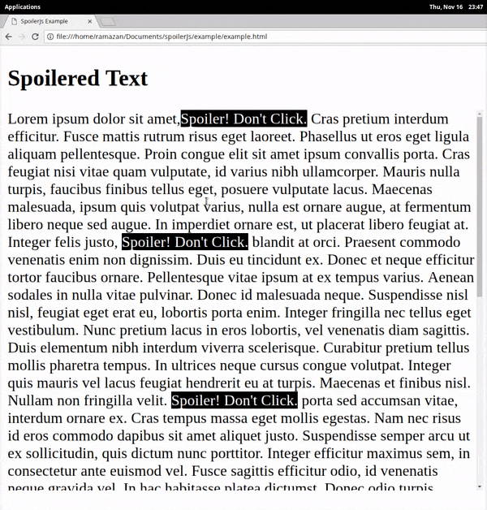

# spoilerJs
It is a script for create inline spoiler spot in html.

Written with JS+JQuery



and very easy to use;


First import jQuery, spoiler.js, spoiler.css...
```html
    <script src="https://cdnjs.cloudflare.com/ajax/libs/jquery/3.2.1/jquery.min.js" charset="utf-8"></script>
    <script src="../src/spoiler.js"></script>
    <link rel="stylesheet" href="../src/spoiler.css">
```
then, ```spoiler()``` it...

```javascript
  spoiler($("#myText"),{title:"Spoiler! Don't Click."});
```

